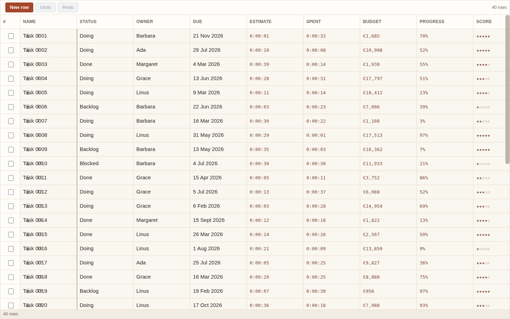

# Tablify

Tablify is a spreadsheet-class grid view for Obsidian Bases: your rows are notes, your columns are their
properties, and the grid behaves the way a spreadsheet does.



## Install

**Tablify 0.1.0 is not in the community directory yet.** The submission is prepared and deliberately not sent:
`docs/06-roadmap.md` §M6 and `docs/10-verification-and-ai-hygiene.md` §the release checklist both require the
release to be verified in-app on a desktop **and** a physical phone before it is tagged, and
`docs/manual-test-log.md` records that verification as **NOT RUN**. This README will say "install from the
community directory" as the first line of this section on the day it is listed; until then the honest version is
below.

### Manually, from a release

1. Download `main.js`, `manifest.json` and `styles.css` from
   [the latest release](https://github.com/258044aamm-Dev/Tablify/releases) (all three; Obsidian needs all three).
2. Put them in `<your vault>/.obsidian/plugins/tablify/` — the folder name must match the manifest's `id`.
3. In Obsidian: **Settings → Community plugins → Reload installed plugins**, then enable **Tablify**. (With
   Restricted mode on, turn it off first.)

### With BRAT, for a pre-release

Add this repository in [BRAT](https://github.com/TfTHacker/obsidian42-brat) (*Add a beta plugin*) and let it
install the release assets; BRAT tracks tags, so a later release arrives as an update.

### From a clone, for development

```bash
bun install          # Bun 1.4.2 or newer
bun run build        # writes main.js
bun run check        # typecheck, lint, tests, build, contrast, size — the gate every commit passes
```

Point `.obsidian/plugins/tablify/` at the clone (or symlink it) and copy `main.js`, `manifest.json` and
`styles.css` in after a build.

## What it does

Rows are notes and columns are properties: nothing is mirrored, nothing is imported into a second store, and
there is no Tablify file format to migrate away from later.

- **Grid rendering** — virtualised rows; sticky header; the first column pinned *only while the pane is wide
  enough* (nothing is pinned below 600 px); three row heights; column resize; column reorder; row reorder by
  drag; grouped sections.
- **Selection** — a cell, a rectangular range, a whole row or column, or everything; shift-click and shift-arrow
  extension; a row-checkbox column.
- **Clipboard** — copy as **TSV and HTML** (so spreadsheets on both sides understand it); paste TSV from any
  spreadsheet, paste HTML tables, cut, clear.
- **Editing** — type to replace, `Enter` to commit and move down, `Tab` to move right, `Escape` to cancel; one
  editor per property type: text, long text, number, checkbox, date, select, multi-select, rating, attachment.
  A cell writes that note's frontmatter; read-only properties (`file.ctime`, formulas, anything unmappable)
  render as disabled cells with a note, never as inputs that swallow what you type.
- **Bulk operations** — edit a whole column bottom-up, fill down or right from a selection, insert rows,
  duplicate rows, delete rows with a confirmation, set or clear a property across the selection.
- **Import** — CSV, TSV or XLSX → a preview → a choice: create one note per row, or keep the sheet as a single
  `.tabula` file. Column types are inferred and every column can be overridden before anything is written.
  Above 250 rows (configurable) the dialog warns and offers the `.tabula` route first.
- **Export** — the selection or the whole view as TSV or XLSX, to the clipboard or to a file. (CSV export is
  already native in Bases, so it is deliberately not duplicated.)
- **Views of the same data** — everything Bases provides (filters, sorts, grouping, formulas) is inherited
  rather than re-implemented. Tablify adds view options — row height, density, a frozen first column, row
  numbers, option colours — and stores them in the `.base` file's own view config, so they survive a reopen.
- **Optional sync with Airtable** — link a view to one base and table; pull, push, and review conflicts field by
  field before anything is written. The Airtable schema is never modified, new local properties with no
  counterpart are skipped and reported, and remotely deleted records are reported rather than deleted locally.
- **Undo/redo** — every grid operation, including a write that touched a hundred notes, is **one** undo step.

## Network use

> **Network use.** Tablify is local-first and works fully offline. It makes network requests **only** when you
> link a view to Airtable and explicitly run a pull or push. Requests go to `api.airtable.com` using your own
> personal access token, which is stored in Obsidian's secret storage on your device and is never written into
> your vault or into any synced file. Tablify has no telemetry, no analytics and no other endpoints.

## Limitations

- **No formulas, lookups, rollups or linked records in the grid.** Bases' own formulas are inherited and shown;
  Tablify does not add a second formula language, and linked records would need a row identity that notes cannot
  express.
- **No CSV export.** Bases has one; two CSV exporters in one app is a bug, not a feature.
- **`.tabula` is read-only legacy.** Existing `.tabula` files can be migrated into notes, and nothing is ever
  written back to them. The format is frozen and will not grow features.
- **Sync never changes your Airtable schema**, and a remote deletion is never mirrored as a local deletion — it
  is reported and left for you.
- **Screen readers**: the grid exposes roles, accessible names and one polite live region for completed writes,
  and the keyboard table below works from the moment a cell has focus. Editing a cell with a screen reader
  inside a virtualised grid is the part of this plugin that has had the least real-device exercise — see
  `docs/manual-test-log.md`, where the screen-reader row reads NOT RUN.
- **Mobile is first-class but secondary in testing.** The layout is built for a phone (nothing pinned on a
  narrow pane, 16 px inputs so iOS does not zoom, safe-area insets, long-press for the context menu), and the
  same limits apply: the phone rows in the manual log are NOT RUN until someone runs them on a phone.
- **No data recovery guarantees, no Airtable account troubleshooting**, and no support for forks of Bases.

## Keyboard

| Keys | What it does |
|---|---|
| Arrow keys (Shift to extend) | Move the active cell / extend the selection |
| Home / End / PageUp / PageDown / Ctrl+Home / Ctrl+End | Jump within the visible band, or to the first and last cell |
| Enter / F2 | Edit the active cell |
| Tab / Shift+Tab | Commit and move right / left |
| Any printable key | Replace the cell's contents and start editing |
| Space (on a checkbox cell) | Toggle it |
| Cmd/Ctrl+C / X / V | Copy / cut / paste the selection |
| Cmd/Ctrl+Z / Shift+Cmd/Ctrl+Z / Ctrl+Y | Undo / redo (one step per user action) |
| Cmd/Ctrl+A | Select everything |
| Cmd/Ctrl+Enter | Edit the whole column at once |
| Delete / Backspace | Clear the selection |
| Alt+D / Alt+R (also Cmd/Ctrl+D, Ctrl+R) | Fill down / fill right |
| Escape | Cancel the edit, or drop the selection |
| F1 / ? | Keyboard help |

Two commands are available from the command palette: **Show version** and **Open keyboard help**. Sync is opened
from its own command, or from a linked view.

## Licence and attribution

MIT — see [LICENSE](LICENSE), which contains both copyright lines. [NOTICE](NOTICE) records what this project
began as and what that means: Tablify is an independent work inspired by
[`airtable-tabula`](https://github.com/MehulG/airtable-tabula) (MIT), whose `.tabula` format and CSV/Excel import
path this project carries forward, and Tablify is not affiliated with, endorsed by or sponsored by Airtable or
Obsidian. No third-party brand assets, logos or wordmarks are included or approximated.
